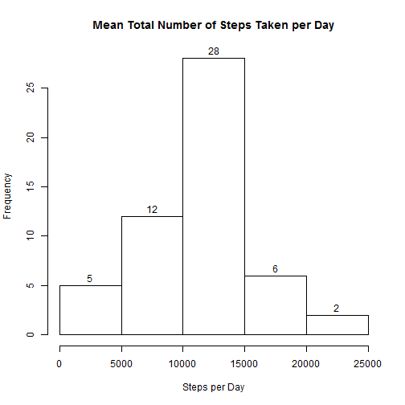
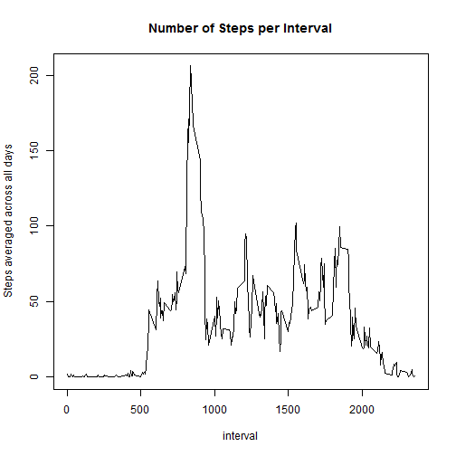
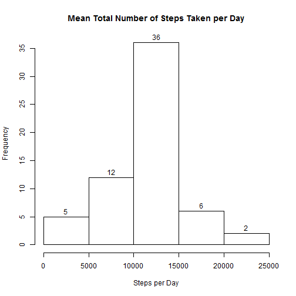
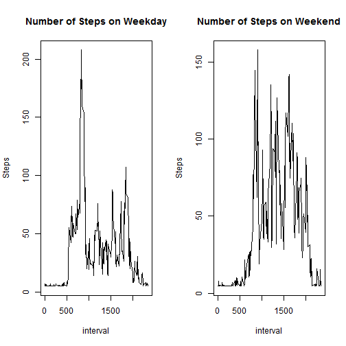

## Preparing for the assignment
1. Load necessary packages

```r
if (!require(dplyr)) {
        install.packages("dplyr")
        library(dplyr) 
}
if (!require(lubridate)) { 
        install.packages("lubridate")
        library(lubridate) 
}
```

2. Set working directory

```r
assignment_dir = "C:\\GIT\\DS\\RR\\assignment1"
if (!file.exists(assignment_dir)) { 
        dir.create(assignment_dir) 
}
setwd(assignment_dir)
```

3. Download activity monitoring data

```r
activity_data= "activity.csv"
url = "https://d396qusza40orc.cloudfront.net/repdata%2Fdata%2Factivity.zip"
if (!file.exists(activity_data)) {
        download.file(url, "activity.zip")
        unzip("activity.zip")
}
```

## Loading and preprocessing the original data
1. Load the data

```r
A <- read.csv(activity_data)
```

2. Process / transform the data

```r
A$date <- as.Date(A$date, "%F")
```

```
## Warning: unable to identify current timezone 'U':
## please set environment variable 'TZ'
## Warning: unknown timezone 'localtime'
```

## What is the mean total number of steps taken per day?
1. Make a histogram of the total number of steps taken each day

```r
complete <- complete.cases(A)
by_date <- group_by(A[complete, ], date)
total <- summarize(by_date, daily_steps = sum(steps))
hist(total$daily_steps, labels = TRUE, main = "Mean Total Number of Steps Taken per Day", xlab = "Steps per Day")
```

 

2. Calculate and report the mean and median total number of steps taken per day

```r
mean_per_day <- mean(total$daily_steps)
median_per_day <- median(total$daily_steps)
cat("Mean number of steps taken per day:", round(mean_per_day))
```

```
## Mean number of steps taken per day: 10766
```

```r
cat("Median number of steps taken per day:", round(median_per_day))
```

```
## Median number of steps taken per day: 10765
```

## What is the average daily activity pattern?
1. Make a time series plot (i.e. type = "l") of the 5-minute interval (x-axis) and the average number of steps taken, averaged across all days (y-axis)

```r
by_interval <- group_by(A[complete, ], interval)
activity <- summarize(by_interval, average_steps = mean(steps))
with(activity, plot(interval, average_steps, type = "l", ylab = "Steps averaged across all days",
                    main = "Number of Steps per Interval"))
```

 

2. Which 5-minute interval, on average across all the days in the dataset, contains the maximum number of steps?

```r
max_steps <- max(activity$average_steps)
most_active_interval <- activity[which(activity$average_steps == max_steps), ]
cat("Interval", most_active_interval$interval, "is the most active with", 
    round(most_active_interval$average_steps), "steps")
```

```
## Interval 835 is the most active with 206 steps
```

## Imputing missing values
1. Calculate and report the total number of missing values in the dataset (i.e. the total number of rows with NAs)

```r
incomplete <- !complete.cases(A)
cat("Number of missing values:", sum(incomplete))
```

```
## Number of missing values: 2304
```

2. Create a new dataset that is equal to the original dataset but with the missing data filled in with the total mean steps per interval.

```r
intervals_per_day = 24 * 12
B <- A
B[incomplete, ]$steps <- round(mean_per_day / intervals_per_day)
```

3. Make a histogram of the total number of steps taken each day and calculate and report the mean and median total number of steps taken per day. Do these values differ from the estimates from the first part of the assignment? What is the impact of imputing missing data on the estimates of the total daily number of steps?

```r
by_date <- group_by(B, date)
total <- summarize(by_date, daily_steps = sum(steps))
hist(total$daily_steps, labels = TRUE, main = "Mean Total Number of Steps Taken per Day", xlab = "Steps per Day")
```

 

```r
mean_per_day2 <- mean(total$daily_steps)
median_per_day2 <- median(total$daily_steps)
cat("Mean number of steps taken per day:", round(mean_per_day2))
```

```
## Mean number of steps taken per day: 10752
```

```r
cat("Median number of steps taken per day:", round(median_per_day2))
```

```
## Median number of steps taken per day: 10656
```


```r
cat("Mean total number of steps per day was slightly reduced by", 
    signif((mean_per_day - mean_per_day2) * 100 / mean_per_day, 2), "percent")
```

```
## Mean total number of steps per day was slightly reduced by 0.13 percent
```

```r
cat("Median total number of steps per day was slightly reduced by", 
    signif((median_per_day - median_per_day2) * 100 / median_per_day, 2), "percent")
```

```
## Median total number of steps per day was slightly reduced by 1 percent
```

## Are there differences in activity patterns between weekdays and weekends?
1. Create a new factor variable in the dataset with two levels - "weekday" and "weekend" indicating whether a given date is a weekday or weekend day.

```r
B <- transform(B, day = wday(B$date, label = TRUE))
B$day <- sapply(B$day, function(x) {
        if (x == "Sat" | x == "Sun") { 
                factor("weekend") 
        } else { 
                factor("weekday") 
        }
})
```

2. Make a panel plot containing a time series plot (i.e. type = "l") of the 5-minute interval (x-axis) and the average number of steps taken, averaged across all weekday days or weekend days (y-axis). See the README file in the GitHub repository to see an example of what this plot should look like using simulated data.

```r
by_day_interval <- group_by(B, day, interval)
activity <- summarize(by_day_interval, average_steps = mean(steps))
par(mfrow = c(1, 2))
with(subset(activity, day == "weekday"),
     plot(interval, average_steps, type = "l", ylab = "Steps", main = "Number of Steps on Weekday"))
with(subset(activity, day == "weekend"),
     plot(interval, average_steps, type = "l", ylab = "Steps", main = "Number of Steps on Weekend"))
```

 
